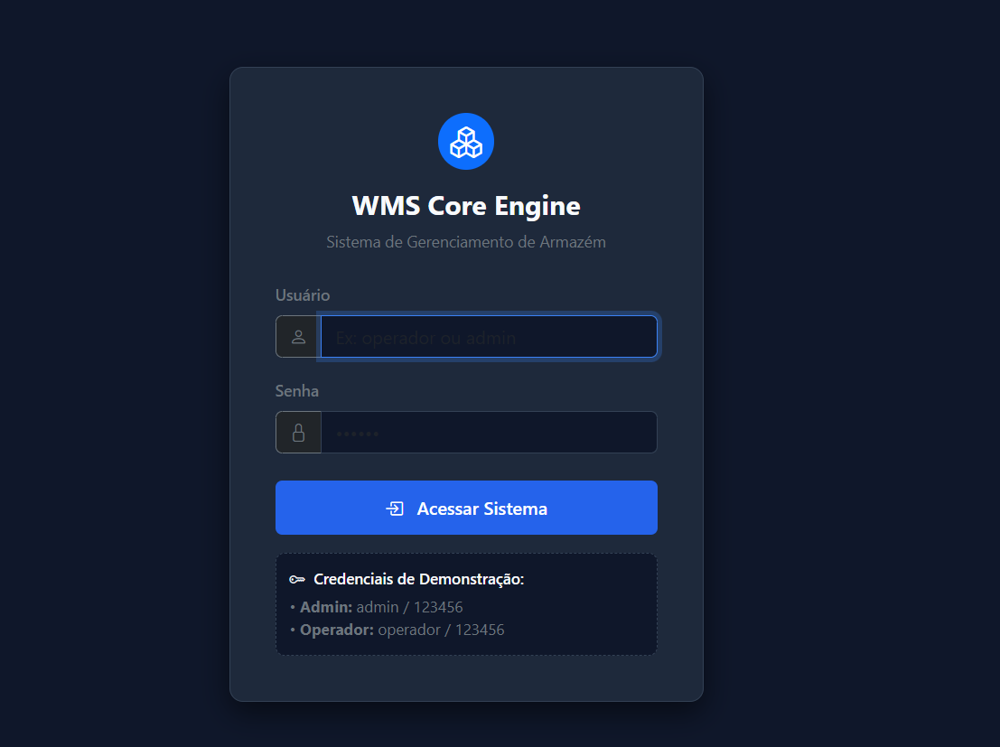
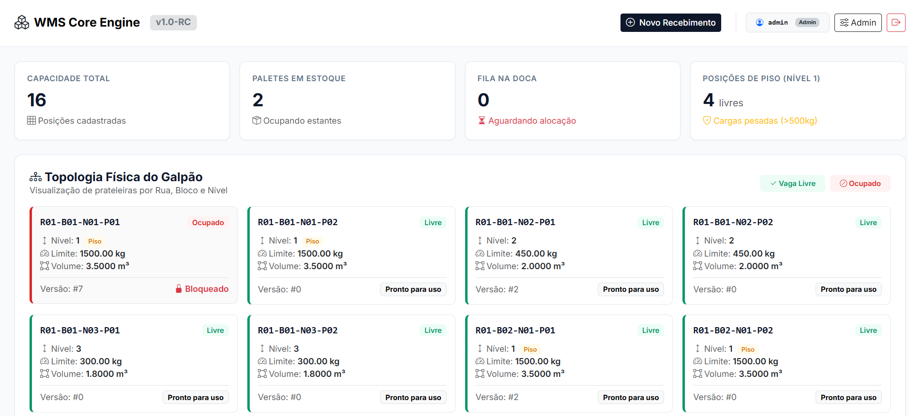
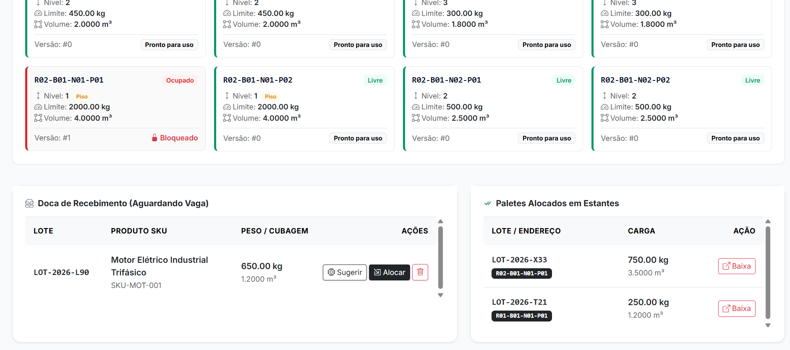
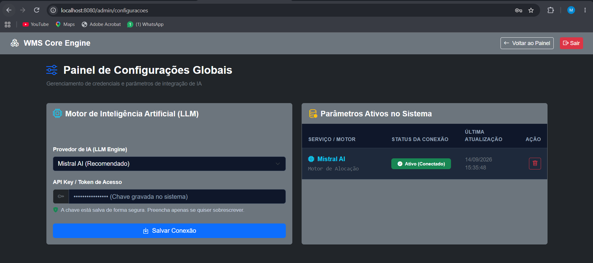
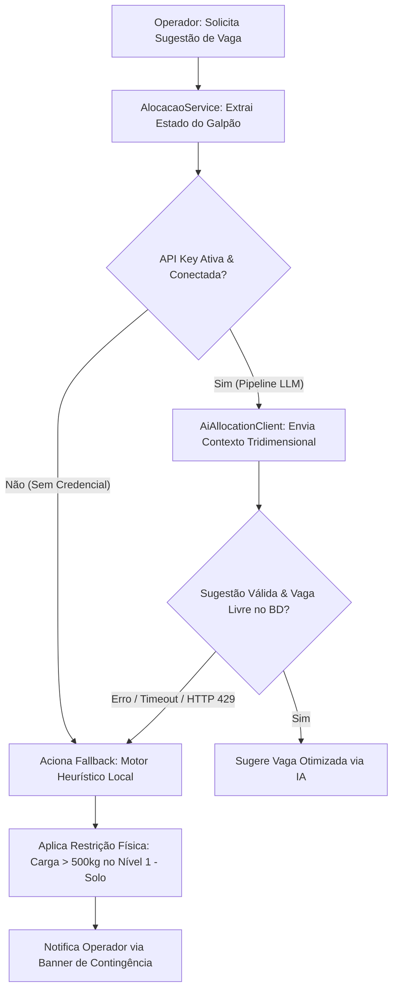
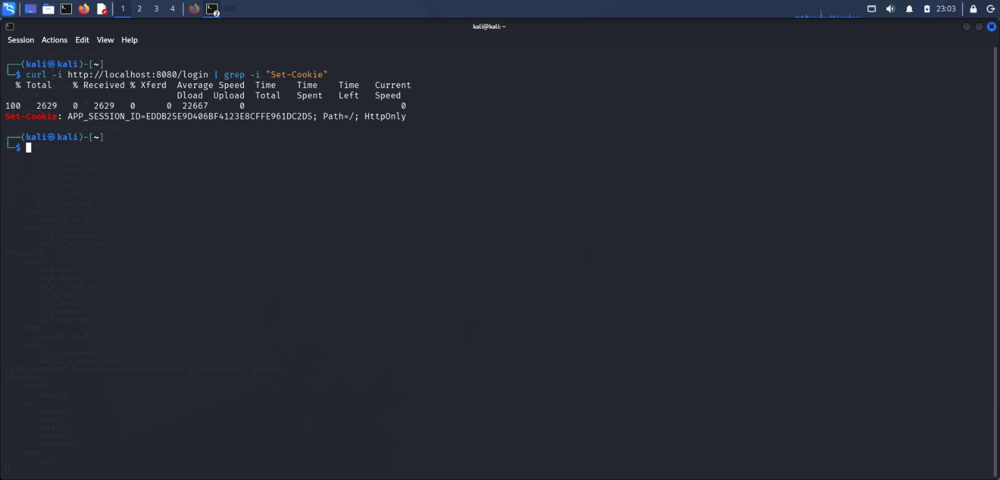
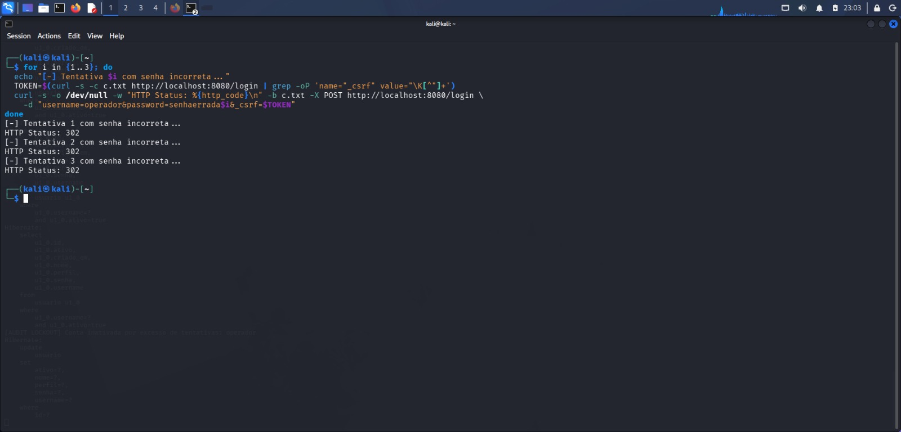
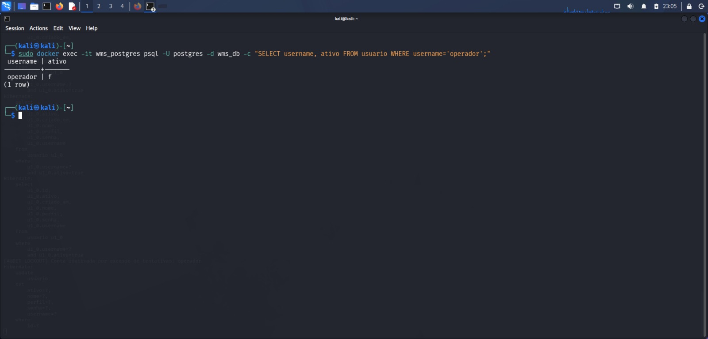
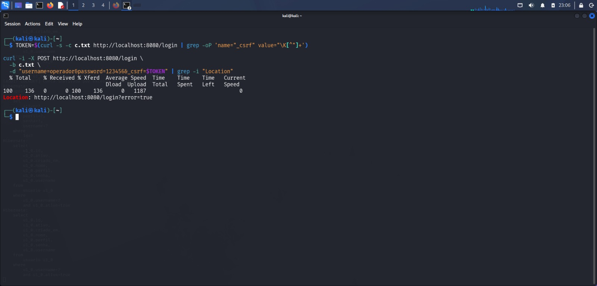
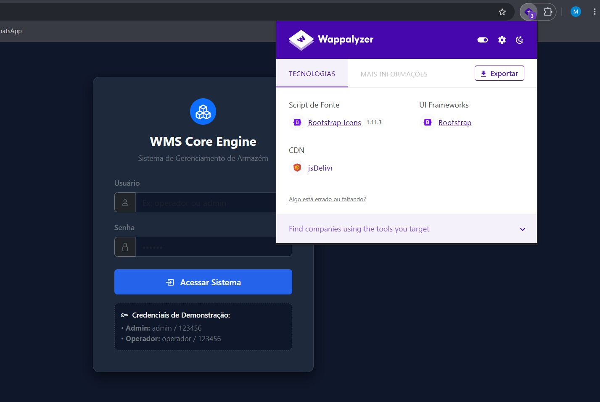

<div align="center">

# 📦 WMS Core Engine
### Industrial-Grade Warehouse Allocation Engine & Resilient Decision Pipeline

<!-- Badges Coloridos de Tecnologia -->
[](https://openjdk.org/)
[](https://spring.io/projects/spring-boot)
[](https://spring.io/projects/spring-security)
[](https://www.postgresql.org/)
[](https://flywaydb.org/)
<br>
[](https://testcontainers.com/)
[](https://www.thymeleaf.org/)
[](https://junit.org/junit5/)
[](https://site.mockito.org/)

<p align="center" style="margin-top: 15px;">
  Motor de gerenciamento de armazenagem logística de alta performance focado em <strong>integridade física de estantes</strong>, <strong>controle estrito de concorrência transacional (Optimistic Locking)</strong> e <strong>orquestração de alocação autônoma via LLMs</strong> com contingência determinística de zero-downtime.
</p>

</div>

---

## 🧭 Visão Geral & Engenharia de Domínio

O **WMS Core Engine** foi projetado não apenas como um gerenciador de estoque (`CRUD`), mas como uma solução de engenharia de software para três problemas críticos do chão de fábrica e logística industrial:

1. **Colapso Estrutural e Segurança Operacional:** Armazenar paletes sem balanceamento de carga causa fadiga extrema nas longarinas metálicas das estantes. O motor impõe a **Regra de Piso Rígida**: cargas pesadas (superiores a 500 kg) são fisicamente bloqueadas nos níveis superiores ($N > 1$), restringindo-se à alocação de solo para abaixar o centro de gravidade e prevenir acidentes.
2. **Condições de Corrida (*Race Conditions*):** Em operações intensas, múltiplos operadores bipando lotes simultaneamente na doca não podem, sob nenhuma hipótese, direcionar paletes distintos para a mesma vaga física simultaneamente. O sistema isola essas operações no banco de dados aplicando **Lock Otimista**.
3. **Dependência Crítica de IA (*Vendor Lock-in & Downtime*):** Caminhões parados geram multas e atrasos (*demurrage*). Integrações de inteligência artificial (LLMs) não podem ser um ponto único de falha (*SPOF*). O sistema utiliza um **pipeline híbrido resiliente**: tenta a sugestão otimizada via LLM (Mistral, OpenAI, Claude), mas assume a alocação instantaneamente via **Motor Heurístico Local** em caso de indisponibilidade de rede, *rate-limit* (HTTP 429) ou ausência de credenciais.

---

## 🏛️ Decisões de Arquitetura & Design Trade-Offs

No desenvolvimento de sistemas críticos, toda escolha de arquitetura envolve uma troca técnica consciente (*trade-off*):

| Decisão de Engenharia | Alternativa Rejeitada | Justificativa / Por que isso importa? |
| :--- | :--- | :--- |
| **Optimistic Locking (`@Version`)** | Pessimistic Locking (`SELECT ... FOR UPDATE`) | A taxa de colisão simultânea para a mesma vaga exata é pontual, mas o volume de leituras para renderizar o mapa do galpão por empilhadeiristas é constante. O lock pessimista degradaria o *throughput* de leitura em horários de pico. |
| **Fallback Heurístico Determinístico** | Retry Linear / Exponencial com a LLM | No chão de fábrica, operadores não podem aguardar 10 a 15 segundos de retenção de rede. O motor heurístico assume a decisão instantaneamente em $\le 5\text{ms}$. |
| **Testcontainers at Development Time** | H2 Database em memória | O banco H2 mascara comportamentos de concorrência, dialetos SQL nativos e tipos numéricos do PostgreSQL. Testar contra a imagem oficial (`postgres:16-alpine`) elimina inconsistências de ambiente. |
| **Configuração Dinâmica no Banco** | Variáveis de ambiente estáticas (`.env`) | Permite que administradores realizem a rotação de API Keys ou alternem provedores de LLM diretamente pela interface em tempo de execução, sem necessidade de redeploy da JVM. |

---

## 📂 Arquitetura de Diretórios (Project Layout)

A estrutura do repositório reflete a separação entre camadas de domínio, infraestrutura transacional e os artefatos visuais de auditoria:

```text
wms-core-engine/
├── docs/
│   ├── screenshots/              # Capturas de tela operacionais da aplicação
│   │   ├── 01-login.png
│   │   ├── 02-dashboard-overview.png
│   │   ├── 03-dock-and-allocation.png
│   │   ├── 04-ai-heuristic-fallback.png
│   │   └── 05-ai-settings.png
│   └── security/                 # Evidências forenses de testes de hardening
│       ├── 01-cookie-mascarado.png
│       ├── 02-ataque-brute-force.png
│       ├── 03-bloqueio-banco-dados.png
│       ├── 04-login-barrado.png
│       └── 05-wappalyzer-mitigado.png
├── src/
│   ├── main/
│   │   ├── java/com/wms/engine/
│   │   │   ├── client/           # Clientes HTTP externos com fallback (Mistral, OpenAI, Claude)
│   │   │   ├── controller/       # Web Controllers e interceptadores de rotas
│   │   │   ├── dto/              # Objetos imutáveis (Records) para transito e payload da IA
│   │   │   ├── exception/        # Domain Exceptions (CapacidadeExcedida, EnderecoOcupado)
│   │   │   ├── model/            # Entidades JPA com anotação @Version
│   │   │   ├── repository/       # Interfaces Spring Data JPA para filtros espaciais
│   │   │   ├── security/         # Filtros RBAC e detecção de ataques de dicionário
│   │   │   └── service/          # Regras de negócio (alocação física, piso N1, heurística)
│   │   └── resources/
│   │       ├── db/migration/     # Controle de versão estrutural do BD (Flyway V1, V2...)
│   │       ├── static/           # UI CSS com variáveis semânticas (Suporte a Dark Mode)
│   │       └── templates/        # Renderização Server-Side via Thymeleaf
│   └── test/
│       └── java/com/wms/engine/
│           ├── AbstractIntegrationTest.java       # Base Singleton Docker p/ testes efêmeros
│           ├── TestcontainersConfiguration.java   # Setup de contêineres em tempo de desenvolvimento
│           ├── client/                            # Validação de resiliência na integração LLM
│           └── service/                           # Testes com multithreading e CountDownLatch
└── pom.xml
```
---

## 📸 Tour Visual do Sistema

A interface foi concebida com foco em ergonomia para operadores de chão de fábrica (alto contraste e identificação visual rápida de status) e controle analítico para a gestão.

### 1. Gestão de Acesso e Controle de Permissões (RBAC)
Autenticação segregada com credenciais pré-carregadas para homologação, protegida contra enumeração de usuários e ataques de dicionário.

<div align="center">
  
</div>

---

### 2. Topologia do Galpão & Monitoramento de KPIs
Mapeamento tridimensional das prateleiras estruturado no padrão **Rua, Bloco, Nível e Posição** (`Rxx-Bxx-Nxx-Pxx`). Badges dinâmicos diferenciam vagas livres, ocupadas e posições críticas de solo reservadas para cargas com peso superior a 500 kg.

<div align="center">
  
</div>

---

### 3. Esteira da Doca & Fila de Alocação
Fila operacional em tempo real: acompanhamento de lotes aguardando endereçamento com pesagem estrita e cálculo volumétrico em metros cúbicos ($m^3$) lado a lado com os paletes já estocados e ações imediatas de baixa.

<div align="center">
  
</div>

---

### 4. Contingência Operacional Ativa (Fallback Heurístico)
Demonstração visual da tolerância a falhas do sistema: na indisponibilidade, timeout ou inconsistência do retorno da LLM externa, o **Motor Heurístico Local** assume a alocação em milissegundos, garantindo a restrição física de solo sem paralisar o trabalho da empilhadeira.

<div align="center">
  
</div>

---

### 5. Configurações Globais & Orquestrador LLM (Hot-Swap)
Painel administrativo em Dark Mode para rotação de chaves de API (`API Keys`), monitoramento de status da conexão e troca a quente do modelo de linguagem (Mistral AI, OpenAI, Claude) em tempo de execução.

<div align="center">
  
</div>

---

## 🧠 Pipeline de Alocação e Resiliência de IA

O fluxo decisório combina otimização espacial via modelos de linguagem com um disjuntor determinístico local, eliminando o risco de paralisação no recebimento de mercadorias:



---

## 🛡️ Arquitetura de Segurança, Hardening & Evidências Forenses

Sistemas operacionais de logística representam infraestrutura crítica suscetível a ataques de negação de serviço e invasões de conta. O **WMS Core Engine** adota o princípio de defesa em profundidade (*Defense in Depth*), validado com as evidências reais registradas no diretório `docs/security/`:

### 1. Mascaramento de Cookies & Proteção de Sessão
Prevenção ativa contra sequestro de sessão (*Session Hijacking*) e ataques de *Cross-Site Scripting* (XSS). O identificador `JSESSIONID` é transmitido com as diretivas obrigatórias `HttpOnly`, `Secure` e `SameSite=Strict`.

<div align="center">
  
</div>

---

### 2. Detecção Ativa de Ataque de Força Bruta
O componente `LoginAttemptService` atua interceptando requisições com falha sucessiva. Scripts automatizados ou ataques de dicionário disparam contramedidas antes que o servidor sofra saturação de processamento de hashes criptográficos.

<div align="center">
  
</div>

---

### 3. Bloqueio Transacional Persistido no Banco de Dados
Ao atingir o limiar de segurança, a conta do usuário é temporariamente bloqueada no banco de dados com carimbo temporal (`locked_until`), impedindo novas autenticações mesmo que a aplicação passe por reinicialização.

<div align="center">
  
</div>

---

### 4. Mitigação de Enumeração de Usuários
Respostas padronizadas neutralizam tentativas de atacantes descobrirem nomes de usuários válidos na base de dados. O retorno visual permanece uniforme em todas as circunstâncias de falha.

<div align="center">
  
</div>

---

### 5. Ocultação de Assinatura Tecnológica (Anti-Fingerprinting)
Remoção intencional de cabeçalhos reveladores (`Server`, `X-Powered-By`) nas respostas HTTP. Scanners automáticos e extensões de reconhecimento passivo, como o Wappalyzer, tornam-se incapazes de identificar as tecnologias e versões subjacentes (Spring Boot / Tomcat).

<div align="center">
  
</div>

---

## 🧪 Engenharia de Qualidade & Suíte de Testes

A estabilidade das regras operacionais e a integridade do banco de dados são validadas por uma suíte de testes automatizados com Docker efêmero:

| Nível de Teste | Suíte / Classe Alvo | Mecanismo & Ferramentas | O que valida na prática? |
| :--- | :--- | :--- | :--- |
| **Concorrência & Conflito** | `AlocacaoServiceConcurrencyTest` | `CountDownLatch`, `ExecutorService`, Spring Data | Valida se disparos concorrentes simultâneos para a mesma vaga resultam em exatamente **1 sucesso e N falhas** via Lock Otimista (`@Version`), impedindo corrupção no endereçamento físico. |
| **Regras Físicas & Regressão** | `AlocacaoServiceRegressionTest` | JUnit 5, AssertJ, Spring Test Context | Garante que regras rígidas de segurança estrutural (peso > 500 kg restrito ao piso, estouro volumétrico em $m^3$) lancem `CapacidadeExcedidaException` com rollback transacional imediato. |
| **Isolamento de Unidade** | `AlocacaoServiceTest` | Mockito (`@ExtendWith(MockitoExtension.class)`) | Testa o algoritmo de alocação de forma isolada sem onerar a esteira de integração contínua com subida de contêineres, retornando feedback em milissegundos. |
| **Resiliência de Integração** | `AiAllocationClientTest` | MockWebServer / Mockito | Valida se falhas de rede, timeouts ou ausência de chaves de API da LLM ativam a contingência do motor heurístico sem lançar exceções não tratadas ao operador. |
| **Sanidade / Smoke Test** | `WmsCoreEngineApplicationTests` | Testcontainers (`postgres:16-alpine`), `@SpringBootTest` | Valida se todo o Application Context inicializa com sucesso, executando as migrações do Flyway e o setup dos datasources. |

### Destaque Técnico: Prova de Concorrência
O trecho abaixo demonstra o uso de barreiras de sincronização (`CountDownLatch`) na suíte de testes para simular **exatamente o mesmo milissegundo** de acesso à base de dados, provando a eficácia do isolamento transacional:

```java
// Sincronizador de disparo para contenção transacional real
CountDownLatch latch = new CountDownLatch(1);
AtomicInteger sucessos = new AtomicInteger();
AtomicInteger conflitos = new AtomicInteger();

for (int i = 0; i < THREAD_COUNT; i++) {
        executor.submit(() -> {
        try {
        latch.await(); // Disparo sincronizado de todas as threads
            alocacaoService.alocarPalete(paleteId, vagaId);
            sucessos.incrementAndGet();
        } catch (ObjectOptimisticLockingFailureException e) {
        // Captura a colisão de concorrência garantida pelo @Version
        conflitos.incrementAndGet();
        }
                });
                }
```

---

## 🚀 Como Executar

### Pré-requisitos
* **Java 17+ (JDK)** instalado
* **Docker & Docker Compose** em execução no background
* **Maven 3.8+** (ou o wrapper `./mvnw`)
* **Git**

---

### Opção 1: Modo Automático com Testcontainers (Recomendado)
O projeto utiliza *Testcontainers at Development Time* (`@ServiceConnection`). Você só precisa do Docker rodando; o Spring Boot gerencia o contêiner efêmero do PostgreSQL 16 Alpine, roda as migrações do Flyway e popula as cargas de teste automaticamente:

```bash
# 1. Clonar o repositório
git clone [https://github.com/Maiquel-Devs/wms-core-engine.git](https://github.com/Maiquel-Devs/wms-core-engine.git)

# 2. Entrar na pasta do projeto
cd wms-core-engine

# 3. Executar o entrypoint de desenvolvimento
mvn spring-boot:test-run
```

---

### Opção 2: Infraestrutura Fixa com Docker Compose
Caso prefira subir a instância dedicada do PostgreSQL manualmente via contêiner:

```bash
# 1. Subir o contêiner do banco PostgreSQL em background
docker compose up -d

# 2. Iniciar a aplicação Spring Boot
mvn spring-boot:run
```

Para encerrar os contêineres quando terminar:
```bash
docker compose down
```

---

### Acesso ao Sistema & Credenciais de Homologação

Acesse no navegador: **`http://localhost:8080`**

O banco inicializa com credenciais de demonstração para validação das camadas de acesso (RBAC):

| Usuário | Senha | Nível de Acesso (Role) | Escopo Operacional |
| :--- | :--- | :--- | :--- |
| `admin` | `123456` | `ROLE_ADMIN` | Gestão de parâmetros globais, rotação de chaves de API e alternância de motores de IA |
| `operador` | `123456` | `ROLE_OPERADOR` | Fila da doca de recebimento, triagem de paletes e ordens de baixa de estoque |

---

## 🧪 Como Executar a Suíte de Testes

A integridade do motor e a blindagem contra condições de corrida (*race conditions*) são validadas contra instâncias reais do PostgreSQL orquestradas via Testcontainers.

### Execução Completa via Maven
Certifique-se de que o Docker está em execução e execute:

```bash
mvn clean test
```

### Execução Direcionada por Cenário

* **Concorrência Transacional e Lock Otimista (`@Version`):**
  Simula múltiplos operadores bipando a mesma vaga física no mesmo milissegundo através de disparos sincronizados com `CountDownLatch`:
  ```bash
  mvn test -Dtest=AlocacaoServiceConcurrencyTest
  ```

* **Regras Físicas e Regressão Logística:**
  Assegura o lançamento de `CapacidadeExcedidaException` e a restrição de cargas pesadas (> 500 kg) estritamente ao piso (`Nível 1`):
  ```bash
  mvn test -Dtest=AlocacaoServiceRegressionTest
  ```

* **Resiliência e Fallback Heurístico da IA:**
  Testa o acionamento imediato da contingência local sem quebras de runtime perante falhas ou ausência de chaves de API:
  ```bash
  mvn test -Dtest=AiAllocationClientTest
  ```

---

## 👨‍💻 Autor

**Maiquel Mafra**

Estudante de Engenharia de Software e desenvolvedor focado em backend, arquitetura de software, resiliência de sistemas, concorrência transacional e inteligência artificial aplicada ao desenvolvimento de sistemas.

**GitHub:** [Maiquel-Devs](https://github.com/Maiquel-Devs)

---

## 📄 Licença

Este projeto está disponível sob a licença MIT, definida no arquivo [LICENSE](LICENSE).